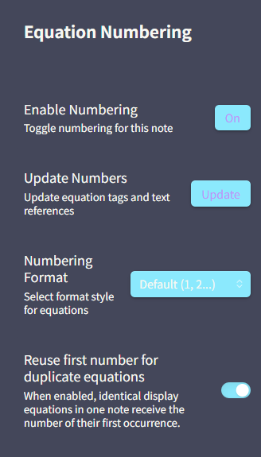

# Auto Equation Numbering for Obsidian

## 😩 还在为手动维护 Obsidian 中的公式编号而痛苦吗？

在撰写包含大量数学公式的 Markdown 笔记时，你是否也曾被以下“排版噩梦”折磨：

* **“牵一发而动全身”的重排痛苦**：在长篇笔记中间插入或删除一个公式，后面所有公式的 `\tag{n}` 必须手动逐个修改，效率极低且极易出错。
* **断开的正文交叉引用**：在正文中手写了 `如公式 (3) 所示...`，一旦前面的公式编号发生变动，你必须人工搜索全文，逐一核对并修改引用。漏掉一个，就会导致读者和自己逻辑错乱。
* **重复公式的编号同步难题**：在复杂的推导过程中，同一个公式可能会在多个地方重复引用。手动管理时，很难保证这些重复公式的编号始终保持一致（或按需独立递增），耗时耗力。
* **LaTeX 语法兼容与报错折磨**：在 Obsidian 中强行配合 `\label` 和 `\tag` 时，常常因为 MathJax 渲染机制导致解析异常或报错，破坏写作流畅度。

---

## 🚀 终结痛点：自动化公式编号与交叉引用

`Auto Equation Numbering` 是一款专为 Obsidian 设计的公式管理插件。它将公式编号和正文交叉引用彻底自动化，让您从繁琐的排版纠错中解放出来，专注于思路的表达。

### ✨ 核心特性

#### 1. 显示公式自动编号与重排

- **全自动解析**：解析 Markdown 文档中的所有独立显示公式（`$$ ... $$`），并在末尾自动追加符合 LaTeX 规范的 `\tag{n}`。
- **免干扰设计**：不对行内公式（`$...$`）和 Markdown 代码块（如 ` ``` ` 块内代码）进行任何处理，保证源码安全。
- **动态更新**：插入、删除公式或调整段落顺序后，只需一键更新，所有公式编号均会自动重新计算与排列。

#### 2. 正文交叉引用智能同步

支持 LaTeX 风格的公式标签声明与正文内的链接引用：

- **定义标签**：在显示公式内部使用 `\label{label_name}` 声明唯一标识符。
- **正文引用**：在正文中使用 Markdown 链接指向该标识符，例如 `[式（）](#eq:model)`。
- **自动填充与同步**：
  - **自动填入**：在首次更新时，插件会自动将最新的公式编号填入括号内（如自动补全为 `[式（1）](#eq:model)`）。
  - **同步变化**：当公式顺序变化导致编号变更时，一键即可让正文中的所有引用链接同步更新，绝无遗漏。

#### 3. 灵活的多样化编号格式

支持全局或单篇笔记独立的公式编号样式定制，满足不同文档与排版规范的要求：

- **Default (默认)**：`1`、`2`、`3`...
- **前缀样式**：`A-1`、`A-2`...
- **小节点样式**：`2.1`、`2.2`...
- **带括号样式**：`(2-1)`、`(2-2)`...
- **Custom (自定义)**：支持完全自定义输入，其中 `*` 占位符将被替换为公式的顺序序号。

#### 4. 重复公式去重机制（可选）

- **核心结构提取**：插件会自动提取并标准化公式的 LaTeX 核心结构（剔除无意义的空白字符与已有 tag）。
- **复用编号**：如果检测到同一篇笔记中存在多个完全相同的公式，默认会复用相同的公式编号，以保证推导的一致性。
- **独立编号**：该机制可在设置中随时关闭。关闭后，每个公式都将获得独立递增的编号。

#### 5. 便捷的交互控制面板

- **侧边控制面板**：点击侧边栏图标或运行 `Open Equation Numbering control panel (Sidebar)` 快速打开侧边栏，支持针对当前笔记启用/禁用编号、切换格式及手动触发更新。
- **状态栏快捷切换**：窗口右下角提供 `🔢` 状态指示与快捷开关，随时切换当前笔记的自动编号状态。

    

---

## 🎬 效果演示

### 1. 公式自动追加 Tag

**原始文本：**

```markdown
$$
\hat{\boldsymbol{y}}_c = \boldsymbol{X}_c\hat{\boldsymbol{\beta}}
$$
```

**自动更新后：**

```markdown
$$
\hat{\boldsymbol{y}}_c = \boldsymbol{X}_c\hat{\boldsymbol{\beta}}
\tag{1}
$$
```

### 2. 交叉引用同步

**编辑中的笔记内容：**

```markdown
$$
y_i = \beta_0 + \sum_{j=1}^p \beta_j x_{ij} + \varepsilon_i
\label{eq:mlr}
$$

如[式（）](#eq:mlr)所示，我们建立了多元线性回归模型。
```

**点击“更新（Update）”后：**

1. 正文中的占位链接被自动填充为：`[式（1）](#eq:mlr)`。
2. 若在当前公式前插入其他公式导致其编号变为 `2`，再次触发更新后，引用链接将自动同步更新为：`[式（2）](#eq:mlr)`。

---

## 🛠️ 安装与构建指南

### 1. 手动安装

1. 克隆或下载本仓库至本地。
2. 在项目根目录下执行依赖安装与打包：
   ```bash
   npm install
   npm run build
   ```
3. 在您的 Obsidian 库中定位到 `.obsidian/plugins/` 目录，并创建一个名为 `obsidian-auto-equation-numbering` 的新文件夹。
4. 将编译生成的 `main.js` 以及项目中的 `manifest.json` 复制到该文件夹中。
5. 在 Obsidian 的“社区插件”设置中重新加载并启用本插件。

### 2. 开发命令

本地开发调试时，可在本目录执行以下命令监听文件变化并自动重新编译：

```bash
npm run dev
```

---

## 💡 技术注意事项

- **手工 Tag 覆盖**：插件会接管显示公式中的 `\tag{...}`。若文档中存在手动写入的 `\tag`，在执行更新时会被插件的自动编号逻辑覆盖。
- **MathJax 渲染兼容处理**：由于 Obsidian 原生的 MathJax 渲染可能对 `\label{...}` 抛出解析异常，插件在重写公式时会为其自动添加 `%` 前缀（即重写为 `% \label{...}`）。该处理仅在渲染层面避免报错，不影响插件对标识符的提取与交叉引用更新。
